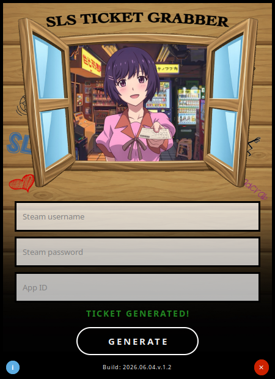

<div align="center">
  
# SLS Ticket Grabber (GUI)
</div>

<div align="center">
  
</div>

<br>

<div align="center">
  
  A GUI wrapper for *SLSsteam Ticket Grabber Tool* — built for SteamOS | SteamDeck.
  
</div>

---

### What is it?:
SLS Ticket Grabber is a lightweight desktop app for SteamOS/SteamDeck. It provides a clean graphical interface for grabbing Steam app ticket manifests using your Steam credentials and an App ID. Instead of running commands in a terminal, just fill in the fields and press Generate.

The app fetches both an **App Ownership Ticket** and an **Encrypted App Ticket** for the specified App ID, and saves them as `.yaml` files in a `Tickets/` folder ready to be used with SLSsteam


<p align="center">
  
</p>

---

### Dependencies:
The AppImage is self-contained for SteamDeck/SteamOS. If running on regular Linux (Arch, Ubuntu, etc.) make sure the following are installed:

→ **GStreamer (Audio):**
```bash
# Arch Linux
sudo pacman -S gstreamer gst-plugins-base gst-plugins-good gst-plugins-bad gst-libav pipewire pipewire-pulse wireplumber

# Ubuntu/Debian
sudo apt install gstreamer1.0-plugins-base gstreamer1.0-plugins-good gstreamer1.0-plugins-bad gstreamer1.0-libav
```

→ **.NET 9 Runtime** — bundled inside the AppImage, no installation needed.

---

### Download:
Head to the [Releases](https://github.com/Ke619/SLS-TG/releases/latest) page and download the latest `SLS-TG.AppImage`

---

### How to use:
1. Launch the AppImage
2. Enter your **Steam username** and **Steam password**
3. Enter the **App ID** of the game you want to grab a ticket for
4. Press **Generate**
5. Approve the **Steam Guard** authentication on your phone when prompted
6. Your tickets will be saved in the `Tickets/` folder *(~/Downloads/Tickets/)*

---

### Status Messages:

<div align="center">
  
| Status | Meaning |
|--------|---------|
| AWAITING STEAM GUARD AUTHENTICATION | Waiting for you to approve on your phone |
| GENERATING YOUR TICKET... | Connected and fetching tickets |
| TICKET GENERATED! | Both tickets saved successfully |
| DISCONNECTED FROM STEAM | Connection lost or wrong credentials |
| OWNERSHIP VERIFICATION FAILED | You may not own this App ID |
| TICKET ENCRYPTION FAILED | Encrypted ticket could not be retrieved |
| INVALID APP ID | The App ID entered is not a valid number |

</div>

---

### Features:

**→ Release v1.0:**
- Dynamic logo that changes based on app state
- Status indicators
- Background music support — *hold the logo for 3 seconds to toggle*
- Sound effects on hover and click
- Sound plays on successful ticket generation

**→ Release v1.1:**
- Added Voice lines reacting to the output **(v1.2)**:
    - On success: *「やったー！うまくいった！できた！」* *("Yay! It worked! I did it!")*
    - On error: *「いいえ、うまくいきませんでした。もう一度試してください。」* *("No, it didn't work. Please try again.")*
  
---

### Notes:
- Requires a valid Steam account with Steam Guard enabled
- The app uses your credentials only to authenticate with Steam — **nothing is stored or transmitted elsewhere**
- Steam Guard approval is done via the Steam mobile app *(no code input needed)*

---

### Legal:
- This project was developed with the knowledge and consent of [AceSLS](https://github.com/AceSLS), the author of [SLSsteam](https://github.com/AceSLS/SLSsteam).
- Character artwork used in logos belongs to their respective copyright holders (Monogatari Series © NisiOisin / Kodansha / Aniplex). Used for non-commercial purposes only.
- This project is licensed under the [AGPL-3.0 License](LICENSE).
- Background Music For SLS-TG (BGM.wav) © 2026 Ke619. Licensed under [CC BY 4.0](https://creativecommons.org/licenses/by/4.0/) — free to use with attribution.

<br><br>

<div align="center">
  Based on the ticket-grabber tool by <a href="https://github.com/AceSLS/SLSsteam">AceSLS</a>
</div>


