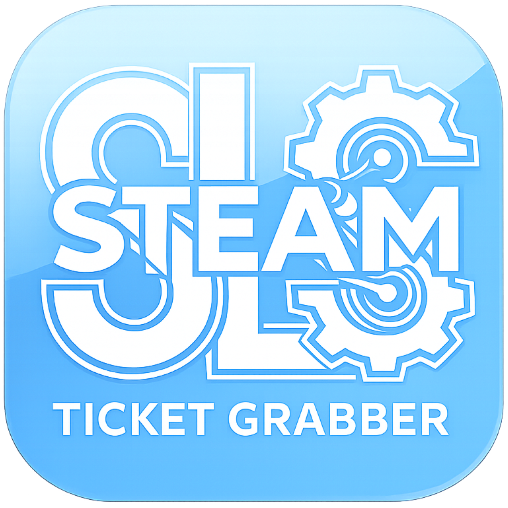

  
# SLS Ticket Grabber (GUI)

  

 

  
  A GUI wrapper for *SLS Steam Ticket Grabber* — built for SteamDeck.
  

---

### What is it?:
SLS Ticket Grabber is a lightweight desktop app for SteamOS/SteamDeck. It provides a clean graphical interface for grabbing Steam app ticket manifests using your Steam credentials and an App ID. Instead of running commands in a terminal, just fill in the fields and press Generate.

The app fetches both an **App Ownership Ticket** and an **Encrypted App Ticket** for the specified App ID, and saves them as `.yaml` files in a `Tickets/` folder.
  

### Download:
Head to the [Releases](https://github.com/Ke619/SLS-TG/releases/latest) page and download `SLS-TG.AppImage`

 

### How to use:
1. Launch the AppImage
2. Enter your **Steam username** and **password**
3. Enter the **App ID** of the game you want to grab a ticket for
4. Press **Generate**
5. Approve the **Steam Guard** authentication on your phone when prompted
6. Your tickets will be saved in the `Tickets/` folder

 

### Status Messages:
| Status | Meaning |
|--------|---------|
| AWAITING STEAM GUARD AUTHENTICATION | Waiting for you to approve on your phone |
| GENERATING YOUR TICKET... | Connected and fetching tickets |
| TICKET GENERATED! | Both tickets saved successfully |
| DISCONNECTED FROM STEAM | Connection lost or wrong credentials |
| OWNERSHIP VERIFICATION FAILED | You may not own this App ID |
| TICKET ENCRYPTION FAILED | Encrypted ticket could not be retrieved |
| INVALID APP ID | The App ID entered is not a valid number |

 

### Features:
- Clean portrait UI with wooden theme
- Animated status indicators
- Background music support — hold the logo for 3 seconds to toggle
- Sound effects on hover and click
- Dynamic logo that changes based on app state
- Sound plays on successful ticket generation

 

### Notes:
- Requires a valid Steam account with Steam Guard enabled
- The app uses your credentials only to authenticate with Steam — nothing is stored or transmitted elsewhere
- Tickets are saved locally in the `Tickets/` folder next to the AppImage
- Steam Guard approval is done via the Steam mobile app (no code input needed)

 

  Based on the ticket-grabber tool by <a href="https://github.com/AceSLS/SLSsteam">AceSLS</a>

